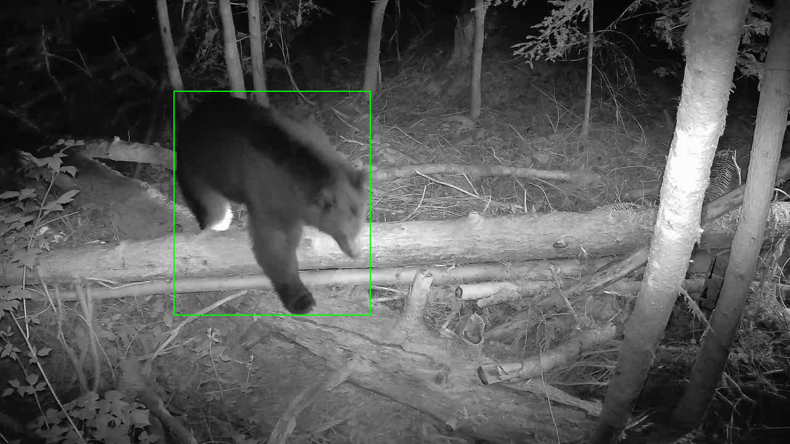
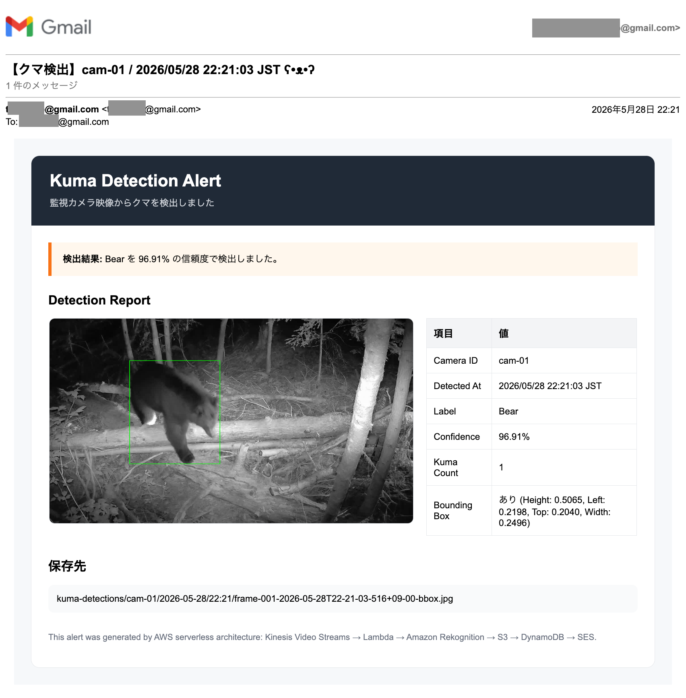
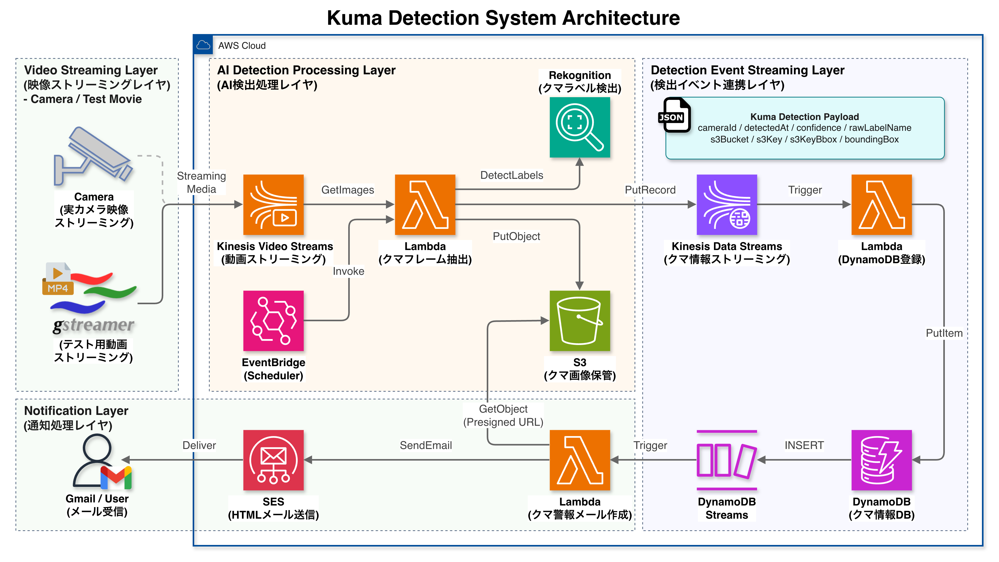
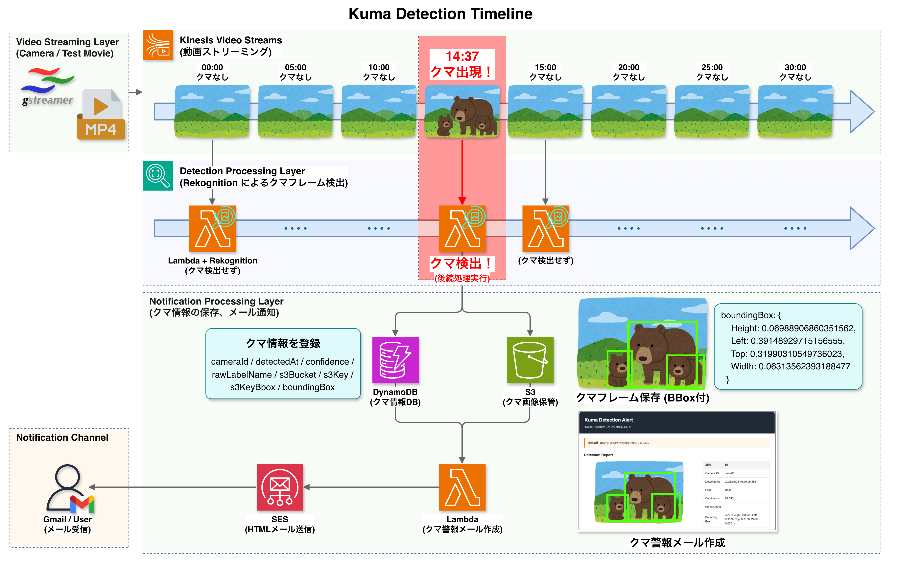

<!-- omit in toc -->
# Kuma Detection System on AWS

本システムは、**監視カメラ映像を AWS 上で解析** し、  
**AI によるクマ検出、Bounding Box 付き画像生成、検出イベント保存、HTML メール通知** を行う  
サーバレスなクマ検出システムである  

Kinesis Video Streams を用いた映像ストリーミング基盤と、  
Amazon Rekognition による画像認識を組み合わせ、  
**「クマが映った瞬間のみイベントを発火する」** リアルタイム監視システムを構築している  

---

- [デモンストレーション](#デモンストレーション)
- [システム概要](#システム概要)
- [主な機能](#主な機能)
- [システムアーキテクチャ](#システムアーキテクチャ)
- [技術的な工夫ポイント](#技術的な工夫ポイント)
- [使用技術](#使用技術)
- [今後の改善ポイント](#今後の改善ポイント)

---

# デモンストレーション

## クマ検出アラート通知

Kinesis Video Streams に送信された監視カメラ映像からフレームを抽出し、  
Amazon Rekognition によりクマを検出する  

クマを検出した場合、以下の処理を自動実行する  

- 検出フレームを S3 に保存
- Bounding Box 付き画像を生成
- 検出イベントを Kinesis Data Streams に送信
- DynamoDB に検出履歴を保存
- SES により HTML メール通知を送信

---

### Bounding Box 付き検出画像
<p align="center">
  
</p>

Bounding Box を描画することで、  
Rekognition が画像内のどの領域をクマとして判定したかを視覚的に確認できる  

---

### HTML メール通知
<p align="center">
  
</p>

通知メールには以下の情報を含めている  

- Camera ID
- 検出時刻（JST）
- Rekognition Label
- Confidence
- クマ検出数
- Bounding Box 情報
- Bounding Box 付き検出画像
- S3 保存先

単なる通知ではなく、  
**「クマ検出レポート」として状況を即時把握できる UI** を意識している  

---

### Rekognition 判定ログ

本システムでは、Amazon Rekognition DetectLabels API を使用し、  
各フレームに含まれるオブジェクトラベルを判定している  

クマ検出時には、以下のように Bear ラベルと Bounding Box が返却される
```json
{
  "Name": "Bear",
  "Confidence": 99.95014953613281,
  "Instances": [
    {
      "BoundingBox": {
        "Height": 0.37886834144592285,
        "Left": 0.07720152288675308,
        "Top": 0.5058383941650391,
        "Width": 0.2531565725803375
      },
      "Confidence": 99.95014953613281
    }
  ]
}
```

---

### CloudWatch Logs

CloudWatch Logs から、  
**フレーム抽出 → Rekognition 判定 → S3 保存 → Kinesis Data Streams 送信 → SES 通知**  
までの一連の処理を確認できる  

<p align="center">
  
</p>

---

# システム概要

近年、住宅地や農地周辺における野生動物の出没が問題となっている  
特にクマの出没は、人身被害や農作物被害につながる可能性があり、**早期検知が重要** となる  

本システムでは、監視カメラ映像を AWS に取り込み、  
**AI 画像認識によってクマを検出し、検出結果を保存・通知** することで、  
野生動物の早期発見や監視業務の効率化を目的としている  

また、Kinesis Video Streams を利用した映像ストリーミング処理により、  
リアルタイム監視システムをサーバレス構成で実現している  

---

# 主な機能

## 1. 監視カメラ映像の取り込み

GStreamer を使用して、  
動画ファイルまたはカメラ映像を Kinesis Video Streams に送信する  

検証では、クマ出現シーンを含む動画ファイルを  
**実際の監視カメラ映像と同じストリーミング方式** で Kinesis Video Streams に送信している  

これにより、  

- テスト動画による検証
- 実カメラ映像への切り替え

を同じアーキテクチャ上で扱うことができ、**実運用への移行が容易** な構成としている  

---

## 2. フレーム抽出

EventBridge により Lambda を定期実行し、  
Kinesis Video Streams の直近映像からフレームを抽出する  

取得したフレームは S3 に保存し、Rekognition の判定対象とする  

---

## 3. AI によるクマ検出

Amazon Rekognition DetectLabels API を使用し、  
フレーム内に **Bear / Black Bear / Brown Bear** などのラベルが含まれるかを判定する  

検出スコアが閾値を超えた場合、クマ検出イベントとして後続処理を実行する  

---

## 4. Bounding Box 付き画像生成

Rekognition が返却した Bounding Box 情報を基に、  
**検出フレーム上に枠線を描画した画像を生成する**  

これにより、**画像のどの領域をクマとして判定したか** を視覚的に確認できる

---

## 5. 検出結果の保存・通知

クマを検出した場合、  
検出イベントを Kinesis Data Streams に送信し、後続 Lambda で DynamoDB に保存する  

DynamoDB Streams をトリガーとして Notifier Lambda を起動し、  
SES 経由で HTML メール通知を送信する  

---

# システムアーキテクチャ

## 全体アーキテクチャ

<p align="center">
  
</p>

本システムは、  
Kinesis Video Streams を中心としたストリーミング処理基盤と、  
Lambda によるイベント駆動処理を組み合わせた **サーバレスアーキテクチャ** として構成している  

特に以下の **ストリーム処理を重視** している

- Kinesis Video Streams による映像ストリーミング
- Kinesis Data Streams による検出イベント連携
- DynamoDB Streams による通知トリガー

---

### Kinesis Video Streams による映像取り込み

KVS を使用することで、以下のようなメリットがある  

- 映像データをリアルタイムに AWS へ送信できる
- Lambda から直近フレームを取得できる
- 実カメラ映像への拡張が容易
- サーバレス構成と組み合わせやすい

---

### EventBridge + Lambda による定期フレーム抽出

EventBridge により Lambda を定期実行し、  
KVS の直近映像から一定間隔でフレームを取得する  

検証時は多めにフレームを取得し、  
本番時は取得頻度を抑えることでコスト最適化できる構成としている  

| モード | SamplingInterval | MaxResults | 用途 |
| --- | --- | --- | --- |
| test | 2000ms | 30 | 検証用 |
| prod | 5000ms | 12 | 本番想定 |

---

### Detection Event Streaming Layer

本システムでは、  
Rekognition の検出結果を Lambda から直接 DynamoDB や通知処理へ渡すのではなく、  
一度 **Kinesis Data Streams に送信する** 構成としている  

これは、**将来的な検出イベント増加や、後続処理の拡張性** を考慮したためである  

Kinesis Data Streams を中継することで、  

- 検出イベントと後続処理を疎結合化できる
- カメラ台数増加時のイベント増加に対応しやすい
- 複数 Consumer による並列処理へ拡張しやすい
- 保存・通知・分析などを独立して追加できる

といったメリットがあり、
例えば将来的には、以下の要素を独立した Consumer として追加可能である

* Slack 通知
* Athena 分析
* Grafana 可視化
* 不審動物統計分析

---

## 検出タイムライン

### ストリーミング検出イメージ

<p align="center">
  
</p>

本システムでは、  
**「クマが映った瞬間のみ検出イベントが発火する」** ストリーミング監視システムを想定している

テストでは、  

- 通常風景
- クマ出現シーン
- 通常風景

を含む動画を Kinesis Video Streams に送信し、  
クマ出現タイミングでのみ Rekognition 検出・通知処理が実行されることを確認している  

---

# 技術的な工夫ポイント

## 1. ストリーミングベースのイベント駆動設計

本システムでは、  

- 映像データ
- 検出イベント
- 通知トリガー

をそれぞれストリームとして扱うことで、**リアルタイム監視システムをイベント駆動で構成** している  

各処理を **疎結合なストリームとして分離** することで、  
将来的なカメラ増設や通知先追加にも対応しやすい構成としている  

---

## 2. KVS フレーム取得データの Base64 デコード対応

Kinesis Video Streams GetImages API の ImageContent は、  
そのまま Rekognition に渡すと InvalidImageFormatException が発生した  

そのため、ImageContent を Base64 デコードして JPEG バイナリへ変換している  

```javascript
const b64 = Buffer.from(img.ImageContent).toString('utf-8');
const jpegBuf = Buffer.from(b64, 'base64');
```

---

## 3. Bounding Box の有無を考慮した処理

Rekognition は Bear ラベルを返しても、必ずしも Bounding Box を返すとは限らない  

そのため、Bounding Box が存在する場合のみアノテーション画像を生成し、  
存在しない場合でも検出イベントとして保存するようにしている  

```javascript
const firstInstance = (topKuma.Instances || [])[0];
const bbox = firstInstance ? firstInstance.BoundingBox : null;
```

---

## 4. SES による HTML メール通知

Notifier Lambda では SES を使用し、  
**Bounding Box 画像付き HTML メール** を送信している  

メール本文には以下を含めている  

- 検出画像
- Confidence
- Bounding Box 情報
- Camera ID
- JST 整形済み検出時刻
- S3 保存先

これにより、通知メール単体で状況を把握できるようにしている  

---

## 5. サーバレスなイベント駆動構成

本システムは、  

- Kinesis Video Streams
- Lambda
- Rekognition
- S3
- Kinesis Data Streams
- DynamoDB
- SES

を組み合わせたサーバレスなイベント駆動構成として設計している  

常駐サーバを持たず、イベント発生時のみ必要な処理を実行する構成となっている  

---

# 使用技術

| 技術 | 用途 | 
| --- | --- | 
| AWS CDK | インフラ構築 | 
| TypeScript | CDK 実装 | 
| Node.js | Lambda 実装 | 
| Amazon Kinesis Video Streams | 監視カメラ映像の取り込み | 
| Amazon Rekognition | AI 画像認識 / クマ検出 | 
| Amazon S3 | 抽出フレーム / BBOX 画像保存 | 
| Amazon Kinesis Data Streams | 検出イベント連携 | 
| AWS Lambda | フレーム抽出 / DynamoDB 保存 / 通知処理 | 
| Amazon DynamoDB | 検出結果保存 | 
| DynamoDB Streams | 検出イベントの通知トリガー | 
| Amazon SES | HTMLメール通知 | 
| Amazon EventBridge | 定期実行 | 
| GStreamer | 映像ストリーミング | 
| Jimp | Bounding Box 画像生成 | 

---

# 今後の改善ポイント

## 実カメラ映像への対応

現在はテスト動画を KVS に送信して検証している  
今後は Raspberry Pi Camera やネットワークカメラからリアルタイム映像を送信し、  
実運用に近い構成へ発展させたい  

---

## 誤検知・未検知への対策

Rekognition の汎用モデルでは、暗所映像や小さく映るクマの判定にばらつきがある  

今後は以下を検討している  

- Confidence 閾値調整
- 複数フレーム連続検出
- Rekognition Custom Labels
- 独自学習済みモデル導入

---

## 運用モード切り替え

現在は検証用に多めのフレームを取得している

本番運用では、

- test: 多めにフレーム取得
- prod: コスト重視

のようにモードを切り替え、
コスト最適化を行う予定である

---

## 監視・可観測性の強化

CloudWatch Metrics / Logs を活用し、以下を可視化したい

- Lambda 実行回数
- Rekognition 実行回数
- クマ検出件数
- SES 通知件数
- エラー件数
- 処理時間

---
