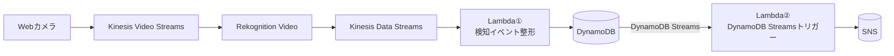

# Rekognition を使用したクマ検出システム構想

## PoC構想  


## Rekognition vido vs Rekognition image
> Amazon Rekognition Video は、Amazon Kinesis Video Streams を使用して、ビデオストリームを受信し処理します。
> ストリームプロセッサを作成するときに、ストリームプロセッサで検出する内容を選択します。
> 人、パッケージ、ペット、または人とパッケージを選択できます。  

[ストリーミングビデオイベント内のラベルの検出](https://docs.aws.amazon.com/ja_jp/rekognition/latest/dg/streaming-video-detect-labels.html)

Rekognition video でクマさんを検出するのは厳しそう…  
👉 動画で検出することは諦めて、Rekognition Image を使用した静止画での検出とする  
精度に不安はあるが `Bear` タグは存在するため検出は可能  


クマ検出までの構成は、以下のパターンが考えられる
1. cam（動画） -> Kinesis Video Streams -> Lambda（フレーム抽出 & 送信） -> Rekognition Image -> ...  
2. cam（静止画を一定間隔で送信） -> API Gateway -> Lambda（バイナリ変換 & 送信） -> Rekognition Image -> ...  

👉 方針として、なるべくAWS内部で処理を集約したい事、リアルタイム寄りのシステムを作りたいため、#1 の KVS を使用するパターンを採用する

## テスト方法
いきなりカメラに接続してクマを撮影するのはハードルが高いため、動画ファイルの映像を Kinesis Video Streams にリアルタイムっぽくストリーミングしてテストを行いたい…！

映像の入力ができれば、以下の一連動作をチェックできる
	•	Kinesis Video Streams → Lambda（フレーム抽出 ＋ Rekognition 検出）
	•	→ Kinesis Data Streams
	•	→ Lambda（kinesis-to-dynamo）
	•	→ DynamoDB
	•	→ Lambda（kuma-notifier）
	•	→ SNSメール通知

今回は Producer SDK（GStreamerプラグイン kvssink）を使う方法を採用する   
公式: http://gstreamer.freedesktop.org/

### GStreamer セットアップの流れ
> [!NOTE]
> Kinesis Video Streams ストリームは CDK で作成済みの前提

1. ビルドツールをインストール  

    ```
    brew install cmake pkg-config
    ```

2. GStreamer の本体とプラグインをインストール  

    ```
    brew install \
    gstreamer \
    gst-plugins-base \
    gst-plugins-good \
    gst-plugins-bad \
    gst-libav
    ```

3. OpenSSLをインストール  

    ```
    brew install openssl
    ```

4.	Kinesis Video Streams Producer SDK（C++版）を導入  

    https://github.com/awslabs/amazon-kinesis-video-streams-producer-sdk-cpp  
    任意のディレクトリに clone する
    ```
    cd ~
    git clone https://github.com/awslabs/amazon-kinesis-video-streams-producer-sdk-cpp.git
    cd amazon-kinesis-video-streams-producer-sdk-cpp
    ```

5. ビルド用ディレクトリを作る  

    ソースとビルド成果物を分けるタイプのプロジェクトなのでディレクトリを作成する
    ```
    mkdir build
    cd build
    # 例: /Users/<UserName>/amazon-kinesis-video-streams-producer-sdk-cpp/build
    ```

6.  cmake 実行 

    OpenSSLのディレクトリ指定とGStreamerのプラグインを有効にしてビルドする  
    OpenSSL のディレクトリを以下のコマンドで確認する
    ```
    brew --prefix openssl
    # 例: /opt/homebrew/opt/openssl@3
    ```
    環境変数に設定して GStreamer をビルドする
    ```
    OPENSSL_ROOT=$(brew --prefix openssl)

    cmake .. \
    -DBUILD_GSTREAMER_PLUGIN=ON \
    -DOPENSSL_ROOT_DIR=$OPENSSL_ROOT
    ```
    `-DBUILD_GSTREAMER_PLUGIN=ON`  
    👉 GStreamer プラグイン kvssink をビルド対象にする  
    `-DOPENSSL_ROOT_DIR=$OPENSSL_ROOT`  
    👉 OpenSSL の場所を指定する

    cmake が成功すると以下のようなメッセージが表示される  
    >Build files have been written to: /Users/<UserName>/amazon-kinesis-video-streams-producer-sdk-cpp/build

7. makeでビルド  

    ```
    make
    ```
    これにより build 配下に以下のファイルが生成される  
	- kvs_gstreamer_sample
	- kvs_gstreamer_file_uploader_sample
	- libgstkvssink.so
	- libKinesisVideoProducer.dylib

8. GStreamer で Kinesis Video Streams に動画をストリーミング  

    今回はビルドで生成された `kvs_gstreamer_sample` を使用して Kinesis Video Streams に動画を送信する

    使い方は以下で確認できる

    ```
    ./kvs_gstreamer_sample
    ```
    >Usage: AWS_ACCESS_KEY_ID=SAMPLEKEY AWS_SECRET_ACCESS_KEY=SAMPLESECRET ./kinesis_video_gstreamer_sample_app my-stream-name path/to/file1 path/to/file2 ...

    AWS 認証情報を環境変数で渡しつつ実行する

    ```
    cd /Users/<UserName>/amazon-kinesis-video-streams-producer-sdk-cpp/build

    export AWS_PROFILE=<your_profile>
    export AWS_REGION=ap-northeast-1
    export AWS_DEFAULT_REGION=ap-northeast-1

    ./kvs_gstreamer_sample <your_stream_name> /Users/<UserName>/path/to/kuma-san.mp4
    ```

    GStreamer は動画ファイルを 再生 しながら Kinesis Video Streams にフレームを送信する  
    👉 KVS 側にはリアルカメラとほぼ同じインターフェースで映像が届く  
    （元動画と同じ fps でストリーミングしてくれる）
