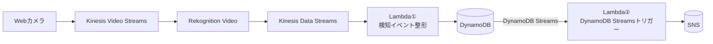
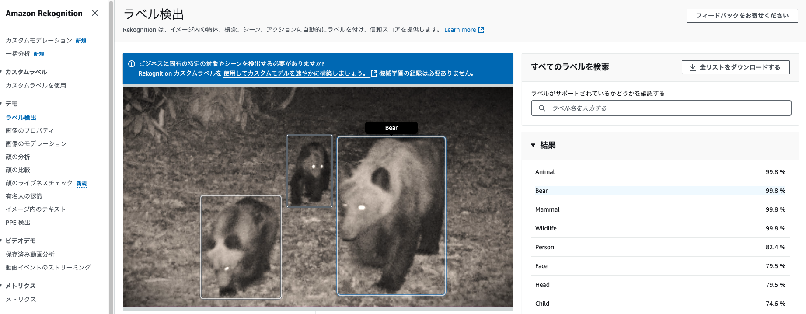

# Rekognition を使用したクマ検出システム構想

## PoC構想  

## Rekognition vido vs Rekognition image
> Amazon Rekognition Video は、Amazon Kinesis Video Streams を使用して、ビデオストリームを受信し処理します。
> ストリームプロセッサを作成するときに、ストリームプロセッサで検出する内容を選択します。
> 人、パッケージ、ペット、または人とパッケージを選択できます。  

[ストリーミングビデオイベント内のラベルの検出](https://docs.aws.amazon.com/ja_jp/rekognition/latest/dg/streaming-video-detect-labels.html)

Rekognition video でクマさんを検出するのは厳しそう…  
👉 動画で検出することは諦めて、Rekognition Image を使用した静止画での検出とする  
精度に不安はあるが `Bear` タグは存在するため検出は可能  

クマ検出までの構成は、以下のパターンが考えられる
1. cam（動画） -> Kinesis Video Streams -> Lambda（フレーム抽出 & 送信） -> Rekognition Image -> ...  
2. cam（静止画を一定間隔で送信） -> API Gateway -> Lambda（バイナリ変換 & 送信） -> Rekognition Image -> ...  

👉 方針として、なるべくAWS内部で処理を集約したい事、リアルタイム寄りのシステムを作りたいため、#1 の KVS を使用するパターンを採用する
